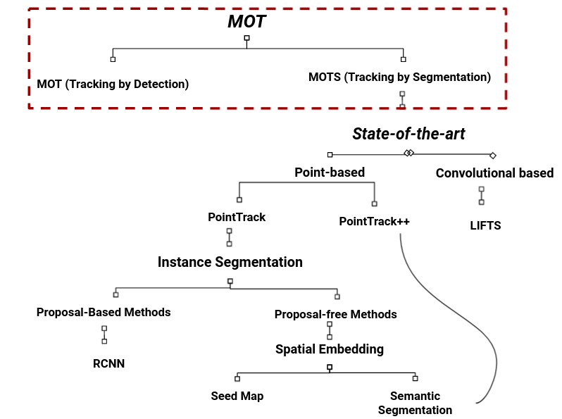
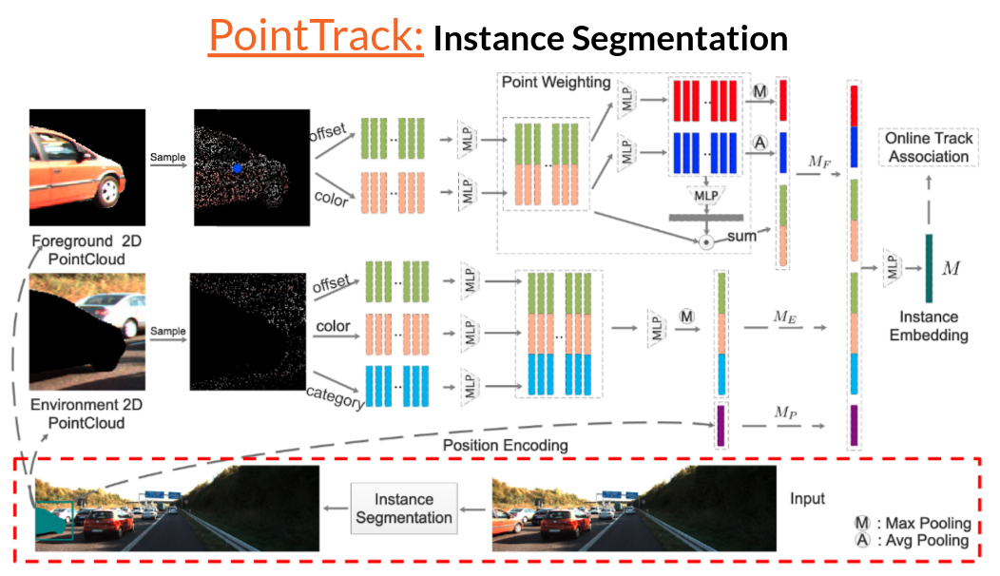

# Multi-modal-Tracking-using-LIDAR-and-Visual-Signals
### Research project on the state of the art in Multi-modal Tracking using LIDAR and Visual Signals  

   
#  Multi-modal-Tracking state-of-the-art tree 
    
# PointTrack pipeline 
  
